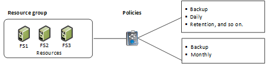

= Recursos, grupos de recursos y políticas
:allow-uri-read: 
:icons: font
:imagesdir: ../media/

[role="lead"]
Antes de usar SnapCenter, es necesariol comprender ciertos conceptos básicos vinculados con las operaciones de backup, clonado y restauración que se ejecutan. El usuario interactúa con recursos, grupos de recursos y políticas para diferentes operaciones.

* *Los recursos* suelen ser las bases de datos, los sistemas de archivos Windows o los recursos compartidos de archivos de los que se realiza una copia de seguridad o se clonan con SnapCenter.
+
No obstante, según cuál sea el entorno, los recursos también pueden ser instancias de bases de datos, grupos de disponibilidad de Microsoft SQL Server, bases de datos de Oracle, base de datos de Oracle RAC, sistemas de archivos Windows o un grupo de aplicaciones personalizadas.

* Un *grupo de recursos* es una colección de recursos en un host o clúster. El grupo de recursos también puede contener recursos de varios hosts y varios clústeres.
+
Cuando se ejecuta una operación con un grupo de recursos, esta se aplica a todos los recursos definidos en el grupo de acuerdo con la programación especificada para el grupo de recursos.

+
Es posible realizar un backup bajo demanda de un solo recurso o de un grupo de recursos. También se pueden configurar backups programados para recursos individuales o grupos de recursos.

+

NOTE: Si se coloca un host de un grupo de recursos compartidos en modo de mantenimiento y existen programaciones asociadas con el mismo grupo, se suspenden todas las operaciones programadas en todos los demás hosts del grupo de recursos compartidos.

+
Es conveniente usar un plugin de base de datos para el backup de bases de datos, un plugin de sistema de archivos para el backup de sistemas de archivos y el plugin de SnapCenter para VMware vSphere para el backup de máquinas virtuales y almacenes de datos.

* *Las directivas* especifican la frecuencia de copia de seguridad, la retención de copias, la replicación, las secuencias de comandos y otras características de las operaciones de protección de datos.
+
Cuando se crea un grupo de recursos, se seleccionan una o varias políticas para él. También es posible seleccionar una política al ejecutar un backup bajo demanda.

Piense en un grupo de recursos como definir _qué_ desea proteger y cuándo desea protegerlo en términos de día y hora. Piense en una directiva como definir _how_ desea protegerla. Cuando se realiza un backup de todas las bases de datos o todos los sistemas de archivos de un host, por ejemplo, puede crearse un grupo de recursos que incluya todas las bases de datos o todos los sistemas de archivos del host. Luego, se pueden vincular dos políticas al grupo de recursos: Una diaria y una horaria.

Cuando se crea el grupo de recursos y se vinculan las políticas, es posible configurar el grupo de recursos para que se ejecute un backup completo todos los días, y agregar una programación que ejecute un backup del registro por hora.

En la siguiente imagen, se muestra la relación entre los recursos, los grupos de recursos y las políticas para las bases de datos:

image::../media/datasets_and_policies.gif[Diagrama de conjunto de datos y políticas]

En la siguiente imagen, se muestra la relación entre los recursos, los grupos de recursos y las políticas para los sistemas de archivos Windows:

