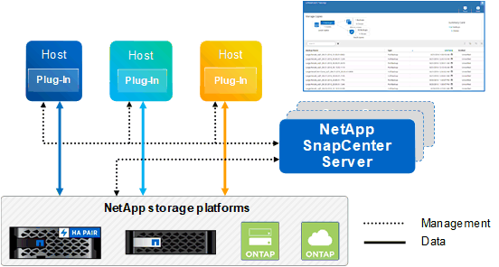

= Información general de SnapCenter
:allow-uri-read: 
:icons: font
:imagesdir: ../media/

[role="lead"]
El software SnapCenter es una plataforma sencilla, centralizada y escalable que proporciona protección de datos consistente con las aplicaciones para aplicaciones, bases de datos, sistemas de archivos host y máquinas virtuales que se ejecutan en sistemas ONTAP en cualquier parte del cloud híbrido.

SnapCenter aprovecha las tecnologías Snapshot, SnapRestore, FlexClone, SnapMirror y SnapVault de NetApp para proporcionar lo siguiente:

* Backup a disco rápido, con gestión eficiente del espacio y consistente con las aplicaciones
* Restauración rápida y granular, y recuperación consistente con las aplicaciones
* Clonado rápido y con un uso eficiente del espacio

SnapCenter incluye tanto SnapCenter Server como plugins individuales ligeros. Es posible automatizar la implementación de plugins en hosts de aplicaciones remotas, programar operaciones de backup, verificación y clonado, y supervisar todas las operaciones de protección de datos.

SnapCenter puede implementarse de las siguientes maneras:

* En las instalaciones para proteger lo siguiente:
+
** Datos en sistemas principales de cabinas ONTAP FAS, AFF o All SAN (ASA) y replicados a sistemas secundarios ONTAP FAS, AFF o ASA
** Datos en sistemas principales ONTAP Select
** Datos en sistemas principales y secundarios de ONTAP FAS, AFF o ASA, y protegidos en el almacenamiento de objetos local de StorageGRID

* En las instalaciones, en un cloud híbrido para proteger lo siguiente:
+
** Datos en sistemas principales ONTAP FAS, AFF o ASA replicados a Cloud Volumes ONTAP
** Datos en sistemas principales y secundarios de ONTAP FAS, AFF o ASA y protegidos para el almacenamiento de objetos y archivos en el cloud (mediante la integración de backup y recuperación de datos de BlueXP).

* En un cloud público para proteger lo siguiente:
+
** Datos sobre sistemas principales de Cloud Volumes ONTAP (antes ONTAP Cloud)
** Datos en Amazon FSX para ONTAP

SnapCenter incluye las siguientes funciones clave:

* Protección de datos centralizada y coherente con las aplicaciones
+
La protección de datos es compatible con Microsoft Exchange Server, Microsoft SQL Server, bases de datos de Oracle en Linux o AIX, base de datos SAP HANA y sistemas de archivos de host Windows que se ejecutan en sistemas ONTAP.

+
La protección de datos también es compatible con otras aplicaciones y bases de datos estándar o personalizadas, ya que proporciona un marco de trabajo para crear plugins de SnapCenter definidos por el usuario. Esto permite proteger datos para otras aplicaciones y bases de datos desde el mismo panel único. Al aprovechar este marco, NetApp ha lanzado complementos personalizados de SnapCenter para IBM DB2, MongoDB, MySQL, etc. en el almacén de automatización de NetApp.

+
https://automationstore.netapp.com/home.shtml["Almacén de automatización del almacenamiento de NetApp"^]

* Backups basados en normativas
+
Los backups basados en políticas aprovechan la tecnología de copia de Snapshot de NetApp para crear backups a disco rápidos, coherentes con las aplicaciones y con gestión eficiente del espacio. De manera opcional, puede automatizar la protección de estos backups en el almacenamiento secundario mediante las actualizaciones de las relaciones de protección existentes.

* Realice backups para varios recursos
+
Puede realizar el backup de varios recursos (aplicaciones, bases de datos o sistemas de archivos de host) del mismo tipo, al mismo tiempo, mediante grupos de recursos de SnapCenter.

* Restauración y recuperación
+
SnapCenter ofrece restauraciones rápidas y granulares de backups y recuperación basada en tiempo y coherente con las aplicaciones. Puede restaurar desde cualquier destino en el cloud híbrido.

* Clonado
+
SnapCenter proporciona un clonado rápido y coherente con las aplicaciones que gestiona el espacio de manera eficiente, lo que permite un desarrollo de software acelerado. Puede clonar en cualquier destino en el cloud híbrido.

* Interfaz gráfica de usuario (GUI) de gestión de usuario única
+
La interfaz gráfica de usuario de SnapCenter proporciona una interfaz única y única para gestionar backups y clones de un recurso en cualquier destino en el cloud híbrido.

* API DE REST, cmdlets de Windows, comandos de UNIX
+
SnapCenter incluye API REST para la mayoría de las funcionalidades para la integración con cualquier software de orquestación, y para el uso de cmdlets de Windows PowerShell y la interfaz de línea de comandos.

+
Para obtener más información sobre las API de REST, consulte https://docs.netapp.com/us-en/snapcenter/sc-automation/overview_rest_apis.html["Información general de la API de REST"].

+
Para obtener más información sobre cmdlets de Windows, consulte https://library.netapp.com/ecm/ecm_download_file/ECMLP2886205["Guía de referencia de cmdlets de SnapCenter Software"^].

+
Para obtener más información sobre comandos UNIX, consulte https://library.netapp.com/ecm/ecm_download_file/ECMLP2886206["Guía de referencia de comandos del software SnapCenter"^].

* Consola de protección de datos y generación de informes centralizadas
* Control de acceso basado en roles (RBAC) para seguridad y delegación.
* Base de datos del repositorio con alta disponibilidad
+
SnapCenter proporciona una base de datos de repositorio integrada con alta disponibilidad para almacenar todos los metadatos de backups.

* Instalación mediante inserción automatizada de plug-ins
+
Puede automatizar una inserción remota de los plugins de SnapCenter desde el host del servidor de SnapCenter a los hosts de aplicaciones.

* Alta disponibilidad
+
La alta disponibilidad de SnapCenter se configura usando el equilibrador de carga externo (F5). Se admiten hasta dos nodos en el mismo centro de datos.

* Recuperación ante desastres (DR)
+
Puede recuperar el servidor SnapCenter en caso de desastres como daños en los recursos o bloqueo del servidor.

== Arquitectura SnapCenter

La plataforma de SnapCenter se basa en una arquitectura de varios niveles que incluye un servidor de gestión centralizado (servidor SnapCenter) y un host de complementos de SnapCenter.

SnapCenter admite centros de datos multisitio. El servidor de SnapCenter y el host del plugin pueden estar en diferentes ubicaciones geográficas.

== Componentes de SnapCenter

SnapCenter consiste en los plugins de SnapCenter Server y SnapCenter. Debe instalar solo los plugins adecuados para los datos que desea proteger.

* Servidor SnapCenter
* Paquete de plugins de SnapCenter para Windows, que incluye los siguientes plugins:
+
** Plugin de SnapCenter para Microsoft SQL Server
** Plugin de SnapCenter para Microsoft Windows
** Plugin de SnapCenter para Microsoft Exchange Server
** Plugin de SnapCenter para base de datos SAP HANA

* Paquete de plugins de SnapCenter para Linux, que incluye los siguientes plugins:
+
** Plugin de SnapCenter para base de datos de Oracle
** Plugin de SnapCenter para base de datos SAP HANA
** Complemento de SnapCenter para UNIX
+

NOTE: El plugin de SnapCenter para UNIX no es un plugin independiente y no se puede instalar de forma independiente. Este plugin se instala automáticamente cuando se instala el plugin de SnapCenter para base de datos de Oracle o el plugin de SnapCenter para base de datos SAP HANA.

* Paquete de plugins de SnapCenter para AIX, incluido los siguientes plugins:
+
** Plugin de SnapCenter para base de datos de Oracle
** Complemento de SnapCenter para UNIX
+

NOTE: El plugin de SnapCenter para UNIX no es un plugin independiente y no se puede instalar de forma independiente. Este plugin se instala automáticamente cuando se instala el plugin de SnapCenter para base de datos de Oracle.

* Plugins personalizados de SnapCenter
+
Los plugins personalizados son compatibles con la comunidad y pueden descargarse en el https://automationstore.netapp.com/home.shtml["Almacén de automatización del almacenamiento de NetApp"^].

El plugin de SnapCenter para VMware vSphere, anteriormente conocido como Data Broker de NetApp, es un dispositivo virtual independiente que admite operaciones de protección de datos de SnapCenter en sistemas de archivos y bases de datos virtualizadas.

== Servidor SnapCenter

El servidor SnapCenter incluye un servidor web, una interfaz de usuario centralizada basada en HTML5, cmdlets de PowerShell, API DE REST y el repositorio de SnapCenter.

SnapCenter ofrece alta disponibilidad y escalado horizontal entre varias instancias de SnapCenter Server dentro de una sola interfaz de usuario. Puede lograr una alta disponibilidad mediante un equilibrador de carga externo (F5). Para entornos más grandes con miles de hosts, añadir varias instancias de SnapCenter Server puede ayudar a equilibrar la carga.

* Si utiliza el paquete de plugins de SnapCenter para Windows, el agente del host se ejecuta en SnapCenter Server y el host de plugins de Windows. El agente del host ejecuta las programaciones de forma nativa en el host Windows remoto; o bien, para instancias de Microsoft SQL Server, la programación se ejecuta en la instancia de SQL local.
+
SnapCenter Server se comunica con los plugins de Windows a través del agente del host.

* Si utiliza el paquete de plugins de SnapCenter para Linux o el paquete de plugins de SnapCenter para AIX, las programaciones se ejecutan en SnapCenter Server como programaciones de tareas de Windows.
+
** Para el plugin de SnapCenter para bases de datos de Oracle, el agente del host que se ejecuta en el host del servidor SnapCenter se comunica con el cargador de plugins (SPL) de SnapCenter que se ejecuta en el host Linux o AIX para realizar distintas operaciones de protección de datos.
** Para el plugin de SnapCenter para bases de datos de SAP HANA y los plugins personalizados de SnapCenter, el servidor de SnapCenter se comunica con estos plugins a través del agente SCCore que se ejecuta en el host.

SnapCenter Server y los plugins se comunican con el agente del host mediante HTTPS. La información sobre las operaciones de SnapCenter se almacena en el repositorio de SnapCenter.

NOTE: SnapCenter admite espacios de nombres separados para hosts Windows. Si tiene problemas al utilizar un espacio de nombres separado, consulte https://kb.netapp.com/mgmt/SnapCenter/SnapCenter_is_unable_to_discover_resources_when_using_disjoint_namespace["SnapCenter no puede detectar recursos al utilizar espacios de nombres separados"].

== Plugins de SnapCenter

Cada plugin de SnapCenter admite entornos, bases de datos y aplicaciones específicas.

|===
| Nombre de complemento | Incluido en el paquete de instalación | Requiere otros plugins | Instalado en el host | Plataforma compatible 

 a| 
Plugin para SQL Server
 a| 
Paquete de plugins para Windows
 a| 
Plugin para Windows
 a| 
Host SQL Server
 a| 
Windows

 a| 
Plugin para Windows
 a| 
Paquete de plugins para Windows
 a| 
 a| 
Host Windows
 a| 
Windows

 a| 
Plugin para Exchange
 a| 
Paquete de plugins para Windows
 a| 
Plugin para Windows
 a| 
Host Exchange Server
 a| 
Windows

 a| 
Plugin para base de datos de Oracle
 a| 
Paquete de plugins para Linux y paquete de plugins para AIX
 a| 
Complemento para UNIX
 a| 
Host Oracle
 a| 
Linux o AIX

 a| 
Plugin para base de datos SAP HANA
 a| 
Paquete de plugins para Linux y paquete de plugins para Windows
 a| 
Plugin para UNIX o plugin para Windows
 a| 
Host del cliente HDBSQL
 a| 
Linux o Windows

 a| 
Plugins personalizados
 a| 
https://automationstore.netapp.com/home.shtml["Almacén de automatización del almacenamiento de NetApp"^]
 a| 
Para backups del sistema de archivos, plugin para Windows
 a| 
Host de aplicación personalizada
 a| 
Linux o Windows

|===

NOTE: El plugin de SnapCenter para VMware vSphere admite operaciones de backup y restauración consistentes con los fallos y consistentes con las máquinas virtuales (VM), almacenes de datos y discos de máquina virtual (VMDK), y admite los plugins específicos para aplicaciones de SnapCenter para proteger operaciones de backup y restauración consistentes con las aplicaciones para bases de datos y sistemas de archivos virtualizados.

Para los usuarios de SnapCenter 4.1.1, la documentación del plugin de SnapCenter para VMware vSphere 4.1.1 tiene información sobre la protección de las bases de datos y los sistemas de archivos virtualizados. Para los usuarios de SnapCenter 4.2.x, la documentación de NetApp Data Broker 1.0 y 1.0.1 ofrece información sobre la protección de bases de datos y sistemas de archivos virtualizados mediante el plugin de SnapCenter para VMware vSphere que proporciona el dispositivo virtual de agente de datos de NetApp basado en Linux (formato de dispositivo virtual abierto). Para los usuarios que utilizan SnapCenter 4.3 o posterior, el https://docs.netapp.com/us-en/sc-plugin-vmware-vsphere/index.html["Documentación del plugin de SnapCenter para VMware vSphere"^] Tiene información sobre la protección de bases de datos virtualizadas y sistemas de archivos mediante el plugin de SnapCenter basado en Linux para el dispositivo virtual VMware vSphere (formato de dispositivo virtual abierto).

=== Funciones del plugin de SnapCenter para Microsoft SQL Server

* Automatiza las operaciones de backup, restauración y clonado para aplicaciones en bases de datos de Microsoft SQL Server en el entorno SnapCenter.
* Admite bases de datos de Microsoft SQL Server en VMDK y LUN de asignación de dispositivo sin formato (RDM) cuando se implementa el plugin de SnapCenter para VMware vSphere y se registra el plugin con SnapCenter
* Admite el aprovisionamiento de solo recursos compartidos SMB. No se ofrece compatibilidad para realizar backups de bases de datos de SQL Server en recursos compartidos de SMB.
* Admite importar backups desde SnapManager para Microsoft SQL Server a SnapCenter.

=== Funciones del plugin de SnapCenter para Microsoft Windows

* Posibilita la protección de datos para aplicaciones de otros plugins que se ejecutan en hosts Windows en el entorno de SnapCenter
* Automatiza las operaciones de backup, restauración y clonado para aplicaciones en sistemas de archivos de Microsoft en su entorno SnapCenter
* Admite el aprovisionamiento de almacenamiento, la consistencia de copias de Snapshot y la reclamación de espacio para hosts Windows
+

NOTE: El plugin para Windows aprovisiona recursos compartidos SMB y sistemas de archivos Windows en LUN de RDM físicos, pero no admite operaciones de backup para sistemas de archivos Windows en recursos compartidos SMB.

=== Funciones del plugin de SnapCenter para Microsoft Exchange Server

* Automatiza las operaciones de backup y restauración para aplicaciones en el entorno de SnapCenter para bases de datos y grupos de disponibilidad de bases de datos (DAG) de Microsoft Exchange Server
* Admite servidores Exchange virtualizados en LUN de RDM cuando se implementa el plugin de SnapCenter para VMware vSphere y se registra el plugin con SnapCenter

=== Funciones del plugin de SnapCenter para bases de datos de Oracle

* Automatiza los backups, las restauraciones, la recuperación, la verificación, el montaje Operaciones de desmontaje y clonado de bases de datos de Oracle en el entorno de SnapCenter
* Sin embargo, no se proporciona integración con BR*Tools de SAP admite bases de datos Oracle para SAP

=== Características del plugin de SnapCenter para UNIX

* Permite al plugin para bases de datos de Oracle realizar operaciones de protección de datos en bases de datos de Oracle manejar la pila de almacenamiento del host subyacente en sistemas Linux o AIX
* Admite los protocolos de sistema de archivos de red (NFS) y red de área de almacenamiento (SAN) en un sistema de almacenamiento que ejecuta ONTAP.
* En el caso de los sistemas Linux, las bases de datos de Oracle en LUN de VMDK y RDM se admiten cuando se implementa el plugin de SnapCenter para VMware vSphere y se registra el plugin con SnapCenter.
* Admite Mount Guard para AIX en sistemas DE archivos SAN y diseño de LVM.
* Admite el sistema de archivos mejorado Journaled (JFS2) con registro en línea en sistemas DE archivos SAN y diseño LVM sólo para sistemas AIX.
+
Se admiten los dispositivos nativos DE SAN, sistemas de archivos y diseños de LVM creados en dispositivos SAN.

=== Funciones del plugin de SnapCenter para base de datos SAP HANA

* Automatiza el backup, la restauración y la clonado de bases de datos de SAP HANA en su entorno SnapCenter

=== Funciones de los plugins personalizados de SnapCenter

* Admite plugins personalizados para gestionar aplicaciones o bases de datos que otros plugins de SnapCenter no admiten. No se incluyen los plugins personalizados como parte de la instalación de SnapCenter.
* Admite la creación de copias reflejadas de conjuntos de backup en otro volumen y la ejecución de la replicación de backup de disco a disco.
* Es compatible con entornos Windows y Linux. En los entornos de Windows, las aplicaciones personalizadas a través de plugins personalizados pueden utilizar, opcionalmente, el plugin de SnapCenter para Microsoft Windows con el fin de realizar backups consistentes del sistema de archivos.

Los ejemplos de plugins personalizados de MySQL, DB2 y MongoDB para el software SnapCenter se pueden descargar de https://automationstore.netapp.com/home.shtml["Almacén de automatización del almacenamiento de NetApp"^].

NOTE: Los plugins personalizados de MySQL, DB2 y MongoDB reciben soporte exclusivamente a través de las comunidades de NetApp.

NetApp admite la funcionalidad de crear y utilizar plugins personalizados; sin embargo, los plugins personalizados que usted crea no son compatibles con NetApp.

Para obtener más información, consulte link:../protect-scc/concept_develop_a_plug_in_for_your_application.html["Desarrolle un complemento para la aplicación"]

== Repositorio de SnapCenter

El repositorio de SnapCenter, que a veces se denomina base de datos NSM, almacena información y metadatos para cada operación SnapCenter.

La base de datos del repositorio de MySQL Server se instala de manera predeterminada cuando se instala el servidor SnapCenter. Si MySQL Server ya está instalado y está realizando una instalación nueva de SnapCenter Server, deberá desinstalar MySQL Server.

SnapCenter admite MySQL Server 5.7.25 o posterior como base de datos del repositorio de SnapCenter. Si utilizaba una versión anterior de MySQL Server con una versión anterior de SnapCenter, durante la actualización de SnapCenter, se actualizó el servidor MySQL a la versión 5.7.25 o posterior.

El repositorio de SnapCenter almacena la siguiente información y metadatos:

* Metadatos de backup, clonado, restauración y verificación
* Información sobre informes, trabajos y eventos
* Información sobre el host y los plugins
* Detalles de roles, usuarios y permisos
* Información de conexiones del sistema de almacenamiento

