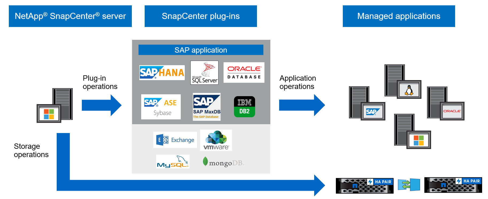

= Información general de SnapCenter
:allow-uri-read: 
:icons: font
:imagesdir: ../media/

[role="lead"]
El software SnapCenter es una plataforma sencilla, centralizada y escalable que ofrece protección de datos consistente con las aplicaciones para aplicaciones, bases de datos, sistemas de archivos host y máquinas virtuales que funcionan en sistemas ONTAP en el cloud híbrido.

SnapCenter aprovecha las tecnologías Snapshot, SnapRestore, FlexClone, SnapMirror y SnapVault de NetApp para proporcionar lo siguiente:

* Backup a disco rápido, con gestión eficiente del espacio y consistente con las aplicaciones
* Restauración rápida y granular, y recuperación consistente con las aplicaciones
* Clonado rápido y con un uso eficiente del espacio

SnapCenter incluye tanto SnapCenter Server como plugins individuales ligeros. Puede automatizar la implementación del plugin en hosts de aplicaciones remotas, programar operaciones de backup, verificación y clonado, y supervisar todas las operaciones de protección de datos.

SnapCenter se puede instalar en las instalaciones o en un cloud público para proteger los datos.

* En las instalaciones para proteger lo siguiente:
+
** Datos en sistemas principales ONTAP FAS, AFF o ASA replicados a sistemas secundarios ONTAP FAS, AFF o ASA
** Datos en sistemas principales ONTAP Select
** Datos en sistemas principales y secundarios de ONTAP FAS, AFF o ASA, y protegidos en el almacenamiento de objetos local de StorageGRID
** Datos en sistemas primarios y secundarios de ONTAP ASA R2

* En las instalaciones, en un cloud híbrido para proteger lo siguiente:
+
** Datos en sistemas principales ONTAP FAS, AFF o ASA replicados a Cloud Volumes ONTAP
** Datos en sistemas principales y secundarios de ONTAP FAS, AFF o ASA y protegidos para el almacenamiento de objetos y archivos en el cloud (mediante la integración de backup y recuperación de datos de BlueXP).

* En un cloud público para proteger lo siguiente:
+
** Datos sobre sistemas principales de Cloud Volumes ONTAP (antes ONTAP Cloud)
** Datos en Amazon FSX para ONTAP
** Datos principales en Azure NetApp Files (Oracle, Microsoft SQL y SAP HANA)

== Principales características

SnapCenter ofrece las siguientes funciones clave:

* Protección de datos centralizada y coherente con las aplicaciones de diferentes aplicaciones
+
La protección de datos es compatible con Microsoft Exchange Server, Microsoft SQL Server, bases de datos de Oracle en Linux o AIX, base de datos SAP HANA, IBM DB2, PostgreSQL, MySQL y sistemas de archivos host de Windows que se ejecutan en sistemas ONTAP. SnapCenter también admite la protección de aplicaciones como MongoDB, Storage, MaxDB, Sybase ASE, ORASCPM.

* Backups basados en normativas
+
Los backups basados en políticas aprovechan la tecnología Snapshot de NetApp para crear backups a disco rápidos, con gestión eficiente del espacio y consistentes con las aplicaciones. De manera opcional, puede automatizar la protección de estos backups en el almacenamiento secundario mediante las actualizaciones de las relaciones de protección existentes.

* Realice backups para varios recursos
+
Puede realizar el backup de varios recursos (aplicaciones, bases de datos o sistemas de archivos de host) del mismo tipo, al mismo tiempo, mediante grupos de recursos de SnapCenter.

* Restauración y recuperación
+
SnapCenter ofrece restauraciones rápidas y granulares de backups y recuperación basada en tiempo y coherente con las aplicaciones. Puede restaurar desde cualquier destino en el cloud híbrido.

* Clonado
+
SnapCenter proporciona un clonado rápido y coherente con las aplicaciones que gestiona el espacio de manera eficiente, lo que permite un desarrollo de software acelerado. Puede clonar en cualquier destino en el cloud híbrido.

* Interfaz gráfica de usuario (GUI) de gestión de usuario única
+
SnapCenter proporciona una GUI que es una interfaz única e integral para gestionar backups y clones de un recurso en cualquier destino en el cloud híbrido.

* API DE REST, cmdlets de Windows, comandos de UNIX
+
SnapCenter proporciona API REST para la mayoría de las funcionalidades para la integración con cualquier software de orquestación, y el uso de cmdlets de Windows PowerShell y la interfaz de la línea de comandos.

* Consola e informes centralizados para la protección de datos
* Control de acceso basado en roles (RBAC) para seguridad y delegación
* Una base de datos de repositorio incorporada con alta disponibilidad para almacenar todos los metadatos de backup
* Instalación mediante inserción automatizada de plug-ins
* Alta disponibilidad
* Recuperación ante desastres (DR)
* SnapLock https://docs.netapp.com/us-en/ontap/snaplock/["Más información"]
* SnapMirror, sincronización activa (lanzado inicialmente como SnapMirror Business Continuity [SM-BC])
* Mirroring sincrónico https://docs.netapp.com/us-en/e-series-santricity/sm-mirroring/overview-mirroring-sync.html["Más información"]

== Arquitectura y componentes de SnapCenter

La plataforma SnapCenter se basa en una arquitectura de varios niveles que incluye un servidor de gestión centralizado y un host de complemento. SnapCenter admite centros de datos multisitio. El host del servidor SnapCenter y el host del plugin pueden estar en diferentes ubicaciones geográficas.

SnapCenter incluye el servidor de SnapCenter, el paquete de plugins de SnapCenter para Windows y el paquete de plugins de SnapCenter para Linux. Cada paquete contiene complementos para distintas aplicaciones y componentes de la infraestructura.

=== Servidor SnapCenter

El servidor SnapCenter es compatible con los sistemas operativos Microsoft Windows y Linux (RHEL 8.x, RHEL 9.x, SLES 15 SP5). El servidor SnapCenter incluye un servidor web, una interfaz de usuario centralizada basada en HTML5, cmdlets de PowerShell, API DE REST y el repositorio de SnapCenter.

SnapCenter Server y los plugins se comunican con el agente del host mediante HTTPS. La información sobre las operaciones de SnapCenter se almacena en el repositorio de SnapCenter.

=== Plugins de SnapCenter

Cada plugin de SnapCenter admite entornos, bases de datos y aplicaciones específicas.

|===
| Nombre de complemento | Incluido en el paquete de instalación | Requiere otros plugins | Instalado en el host | Plataforma compatible 

 a| 
Plugin de SnapCenter para Microsoft SQL Server
 a| 
Paquete de plugins para Windows
 a| 
Plugin para Windows
 a| 
Host SQL Server
 a| 
Windows

 a| 
Complemento de SnapCenter para Windows
 a| 
Paquete de plugins para Windows
 a| 
 a| 
Host Windows
 a| 
Windows

 a| 
Plugin de SnapCenter para Microsoft Exchange Server
 a| 
Paquete de plugins para Windows
 a| 
Plugin para Windows
 a| 
Host Exchange Server
 a| 
Windows

 a| 
Plugin de SnapCentre para base de datos de Oracle
 a| 
Paquete de plugins para Linux y el paquete de plugins para AIX
 a| 
Complemento para UNIX
 a| 
Host Oracle
 a| 
Linux o AIX

 a| 
Plugin de SnapCenter para base de datos SAP HANA
 a| 
Paquete de plugins para Linux y paquete de plugins para Windows
 a| 
Plugin para UNIX o plugin para Windows
 a| 
Host del cliente HDBSQL
 a| 
Linux o Windows

 a| 
Complemento de SnapCenter para IBM DB2
 a| 
Paquete de plugins para Linux y paquete de plugins para Windows
 a| 
Plugin para UNIX o plugin para Windows
 a| 
DB2 host
 a| 
Linux, AIX o Windows

 a| 
Complemento de SnapCenter para PostgreSQL
 a| 
Paquete de plugins para Linux y paquete de plugins para Windows
 a| 
Plugin para UNIX o plugin para Windows
 a| 
Host PostgreSQL
 a| 
Linux o Windows

 a| 
Plug-in de SnaoCenter para MySQL
 a| 
Paquete de plugins para Linux y paquete de plugins para Windows
 a| 
Plugin para UNIX o plugin para Windows
 a| 
Host MySQL
 a| 
Linux o Windows

 a| 
Plugin de SnapCenter para MongoDB
 a| 
Paquete de plugins para Linux y paquete de plugins para Windows
 a| 
Plugin para UNIX o plugin para Windows
 a| 
Host MongoDB
 a| 
Linux o Windows

 a| 
Complemento de SnapCenter para ORASCPM (Aplicaciones Oracle)
 a| 
Paquete de plugins para Linux y paquete de plugins para Windows
 a| 
Plugin para UNIX o plugin para Windows
 a| 
Host Oracle
 a| 
Linux o Windows

 a| 
Complemento de SnapCenter para SAP ASE
 a| 
Paquete de plugins para Linux y paquete de plugins para Windows
 a| 
Plugin para UNIX o plugin para Windows
 a| 
Host SAP
 a| 
Linux o Windows

 a| 
Complemento de SnapCenter para SAP MaxDB
 a| 
Paquete de plugins para Linux y paquete de plugins para Windows
 a| 
Plugin para UNIX o plugin para Windows
 a| 
Host SAP MaxDB
 a| 
Linux o Windows

 a| 
Plugin de SnapCenter para plugin de almacenamiento
 a| 
Paquete de plugins para Linux y paquete de plugins para Windows
 a| 
Plugin para UNIX o plugin para Windows
 a| 
Host de almacenamiento
 a| 
Linux o Windows

|===
El plugin de SnapCenter para VMware vSphere admite operaciones de backup y restauración consistentes con los fallos y consistentes con las máquinas virtuales (VM), almacenes de datos y discos de máquina virtual (VMDK), y admite los plugins específicos para aplicaciones de SnapCenter para proteger operaciones de backup y restauración consistentes con las aplicaciones para bases de datos y sistemas de archivos virtualizados.

Si su base de datos o sistema de archivos están almacenados en máquinas virtuales o si desea proteger máquinas virtuales y almacenes de datos, debe implementar el dispositivo virtual del plugin de SnapCenter para VMware vSphere. Para obtener más información, consulte https://docs.netapp.com/us-en/sc-plugin-vmware-vsphere/index.html["Documentación del plugin de SnapCenter para VMware vSphere"^].

=== Repositorio de SnapCenter

El repositorio de SnapCenter, que a veces se denomina base de datos NSM, almacena información y metadatos para cada operación SnapCenter.

La base de datos del repositorio de MySQL Server se instala de manera predeterminada cuando se instala el servidor SnapCenter. Si MySQL Server ya está instalado y está realizando una instalación nueva de SnapCenter Server, deberá desinstalar MySQL Server.

SnapCenter admite MySQL Server 8.0.37 o posterior como base de datos del repositorio SnapCenter. Si utilizaba una versión anterior de MySQL Server con una versión anterior de SnapCenter, durante una actualización de SnapCenter, MySQL Server se actualiza a la versión 8.0.37 o posterior.

El repositorio de SnapCenter almacena la siguiente información y metadatos:

* Metadatos de backup, clonado, restauración y verificación
* Información sobre informes, trabajos y eventos
* Información sobre el host y los plugins
* Detalles de roles, usuarios y permisos
* Información de conexiones del sistema de almacenamiento

