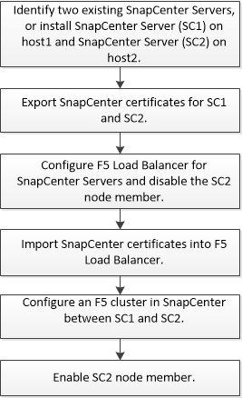

= Configurar servidores SnapCenter para alta disponibilidad mediante F5
:allow-uri-read: 
:icons: font
:imagesdir: ../media/

[role="lead"]
Para admitir la alta disponibilidad (ha) en SnapCenter, puede instalar el equilibrador de carga F5. F5 permite al servidor SnapCenter admitir configuraciones activo-pasivo en hasta dos hosts que se encuentran en la misma ubicación. Para utilizar el equilibrador de carga F5 en SnapCenter, debe configurar SnapCenter Server y el equilibrador de carga F5.

IMPORTANT: Si ha actualizado desde SnapCenter 4.2.x y anteriormente utilizaba balanceo de carga de red (NLB), puede continuar utilizando dicha configuración o cambiar a F5.

La imagen del flujo de trabajo enumera los pasos para configurar SnapCenter Server para una alta disponibilidad utilizando el equilibrador de carga F5. Para obtener instrucciones detalladas, consulte https://["Cómo configurar instancias de SnapCenter Server para obtener una alta disponibilidad mediante el balanceador de carga F5"^].

Debe ser miembro del grupo de administradores locales en SnapCenter Server (además de tener la asignación del rol de administrador de SnapCenter) para usar los siguientes cmdlets con el fin de agregar y quitar clústeres de F5:

* Add-SmServerCluster
* Add-SmServer
* Remove-SmServerCluster
+
Para obtener más información, consulte https://["Guía de referencia de cmdlets de SnapCenter Software"^].

== Información de configuración adicional de F5

* Después de instalar y configurar SnapCenter para alta disponibilidad, edite el acceso directo del escritorio de SnapCenter para que apunte a la IP del clúster de F5.
* Si se produce una conmutación por error entre los servidores SnapCenter y existe también una sesión SnapCenter, debe cerrar el explorador e iniciar sesión en SnapCenter de nuevo.
* En la configuración del equilibrador de carga (NLB o F5), si agrega un nodo que se resuelve parcialmente mediante el nodo NLB o F5, y si el nodo SnapCenter no puede conectarse a este nodo, la página de host de SnapCenter cambia entre los hosts a estado en ejecución con frecuencia. Para resolver este problema, debe asegurarse de que los dos nodos SnapCenter puedan resolver el host en el nodo NLB o F5.
* Los comandos SnapCenter para la configuración de MFA deben ejecutarse en todos los nodos. La configuración de partes de confianza se debe realizar en el servidor de Active Directory Federation Services (AD FS) mediante los detalles del clúster F5. El acceso a la interfaz de usuario de SnapCenter en el nivel de nodo se bloqueará una vez que tenga habilitada la MFA.
* Durante la conmutación por error, la configuración del registro de auditoría no se reflejará en el segundo nodo. Por lo tanto, debe repetir manualmente la configuración del registro de auditoría en el nodo pasivo F5 cuando esté activo.

