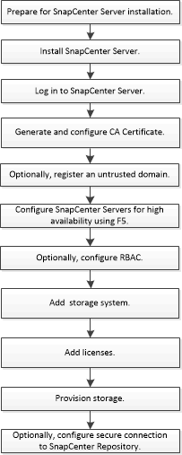

= Flujo de trabajo de instalación
:allow-uri-read: 
:icons: font
:imagesdir: ../media/

[role="lead"]
El flujo de trabajo muestra las distintas tareas necesarias para instalar y configurar el servidor SnapCenter.

