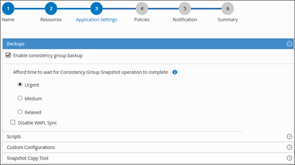

= Crear grupos de recursos y añadir políticas
:allow-uri-read: 
:icons: font
:imagesdir: ../media/

[role="lead"]
Un grupo de recursos es el contenedor al que debe añadir los recursos que desea proteger e incluir en un backup. Permite realizar un backup en simultáneo con todos los datos que están asociados con una determinada aplicación. Un grupo de recursos es necesario para cualquier trabajo de protección de datos. También debe añadir una o más políticas al grupo de recursos para definir el tipo de trabajo de protección de datos que desea realizar.

.Acerca de esta tarea
* Para crear backups de replicación del sistema SAP HANA, se recomienda añadir todos los recursos del sistema SAP HANA a un grupo de recursos. Esto garantiza una copia de seguridad sin problemas durante el modo de recuperación tras fallos.
* Para ONTAP 9.12.1 y versiones anteriores, los clones creados a partir de las snapshots de SnapLock Vault como parte de la restauración heredan el tiempo de caducidad de SnapLock Vault. El administrador de almacenamiento debe limpiar manualmente los clones después del tiempo de caducidad de SnapLock Vault.
* No se admite la adición de bases de datos nuevas sin sincronización activa de SnapMirror a un grupo de recursos existente que contiene recursos con sincronización activa de SnapMirror.
* No se admite la adición de bases de datos nuevas a un grupo de recursos existente en el modo de conmutación por error de la sincronización activa de SnapMirror. Puede añadir recursos al grupo de recursos solo en estado normal o de conmutación por error.

.Pasos
. En el panel de navegación izquierdo, seleccione *Recursos* y, a continuación, seleccione el plugin apropiado de la lista.
. En la página Recursos, selecciona *Nuevo grupo de recursos*.
. En la página Name, realice los siguientes pasos:
+
|===
| Para este campo... | Realice lo siguiente... 

 a| 
Nombre
 a| 
Escriba un nombre para el grupo de recursos.

NOTE: El nombre del grupo de recursos no debe superar los 250 caracteres.

 a| 
Etiquetas
 a| 
Escriba una o más etiquetas que más adelante le permitirán buscar el grupo de recursos.

Por ejemplo, si añadió HR como etiqueta a varios grupos de recursos, más adelante encontrará todos los grupos de recursos asociados usando esa etiqueta.

 a| 
Usa un formato de nombre personalizado para las instantáneas.
 a| 
Marque esta casilla de comprobación e introduzca un formato de nombre personalizado que desee usar para el nombre de snapshot.

Por ejemplo, customtext_resourcegroup_policy_hostname o resource group_hostname. Por defecto, se añade una marca de tiempo al nombre de la instantánea.

|===
. En la página Resources, seleccione un nombre de host de la lista desplegable *Host* y un tipo de recurso de la lista desplegable *Tipo de recurso*.
+
Esto permite filtrar información en la pantalla.

. Seleccione los recursos de la sección *Recursos disponibles* y, a continuación, seleccione la flecha derecha para moverlos a la sección *Recursos seleccionados*.
. En la página Application Settings, realice lo siguiente:
+
.. Seleccione la flecha *backups* para establecer opciones de copia de seguridad adicionales:
+
Habilite el backup del grupo de consistencia y realice las siguientes tareas:

+
|===
| Para este campo... | Realice lo siguiente... 

 a| 
Espere tiempo a que finalice la operación de snapshot de grupo de consistencia
 a| 
Seleccione *Urgente*, *Medio* o *Relacionado* para especificar el tiempo de espera para que se complete la operación de instantánea.

Urgent = 5 segundos, Medium = 7 segundos y Relaxed = 20 segundos.

 a| 
Deshabilite la sincronización WAFL
 a| 
Seleccione este campo para evitar forzar un punto de coherencia de WAFL.

|===
+

.. Selecciona la flecha *Scripts* e ingresa los comandos pre y post para las operaciones de quiesce, snapshot y unquiesce. También puedes ingresar los comandos pre que se ejecutarán antes de salir en caso de fallo.
.. Selecciona la flecha *Custom Configurations* e ingresa los pares clave-valor personalizados que se necesitan para todas las operaciones de protección de datos usando este recurso.
+
|===
| Parámetro | Ajuste | Descripción 

 a| 
ARCHIVE_LOG_ENABLE
 a| 
(S/N)
 a| 
Permite la gestión del registro de archivos para eliminar los registros de archivos.

 a| 
RETENCIÓN_LOG_ARCHIVO
 a| 
número_de_días
 a| 
Especifica el número de días que se retienen los registros de archivo.

Esta configuración debe ser igual o mayor que NTAP_SNAPSHOT_RETENTIONS.

 a| 
ARCHIVE_LOG_DIR
 a| 
change_info_directory/logs
 a| 
Especifica la ruta al directorio que contiene los archive logs.

 a| 
ARCHIVO_LOG_EXT
 a| 
extensión_archivo
 a| 
Especifica una expresión regular que coincide con las extensiones de nombre de archivo de los archivos de registro.

Para los archivos de registro que terminan en un número de dígitos, usa una expresión regular, como  `[0-9+]` o (desde 6.0)  `\d+` (cualquier longitud de dígitos de al menos un carácter) como valor para el parámetro, que representa cualquier número de secuencia de registro en SAP HANA.

 a| 
ARCHIVE_LOG_RECURSIVE_SEARCH
 a| 
(S/N)
 a| 
Permite la gestión de archive logs dentro de subdirectorios.

Deberías usar este parámetro si los registros de archivo están en subdirectorios.

|===
+

NOTE: Se admiten pares clave-valor personalizados para el SnapCenter Plug-in for SAP HANA Database en sistemas Linux, pero no para bases de datos SAP HANA registradas con el SnapCenter Plug-in for Microsoft Windows.

.. Selecciona la flecha *Snapshot Copy Tool* para seleccionar la herramienta para crear instantáneas:
+
|===
| Si desea que... | Realice lo siguiente... 

 a| 
SnapCenter utilice el plugin para Windows y coloque el sistema de archivos en estado coherente antes de crear una copia de Snapshot. En el caso de recursos de Linux, esta opción no es aplicable.
 a| 
Seleccione *SnapCenter with File System Consistency*.

Esta opción no es aplicable para el plugin de SnapCenter para la base de datos SAP HANA.

 a| 
SnapCenter para crear una snapshot a nivel del almacenamiento
 a| 
Seleccione *SnapCenter sin coherencia del sistema de archivos*.

 a| 
Se escriba el comando que se ejecutará en el host a fin de crear copias de Snapshot.
 a| 
Seleccione *Otro* y, a continuación, introduzca el comando que se ejecutará en el host para crear una instantánea.

|===

. En la página Policies, realice los siguientes pasos:
+
.. Seleccione una o varias políticas de la lista desplegable.
+

NOTE: También puedes crear una política seleccionando *image:../media/add_policy_from_resourcegroup.gif["agregue un grupo de recursos de formulario de política"]*.

+
Las políticas figuran en la sección Configure schedules for selected policies.

.. En la columna Configurar horarios, selecciona *image:../media/add_policy_from_resourcegroup.gif["agregue un grupo de recursos de formulario de política"]* para la política que quieres configurar.
.. En el cuadro de diálogo Add schedules for policy _policy_name_, configure la programación y, a continuación, seleccione *OK*.
+
Policy_name es el nombre de la política seleccionada.

+
Los horarios configurados se enumeran en la columna *programas aplicados*.

+
No se admiten programas de backup de terceros cuando se solapan con los programas de backup de SnapCenter.

. En la página Notification, en la lista desplegable *Email preference*, seleccione los escenarios en los que desea enviar los correos electrónicos.
+
También debe especificar las direcciones de correo electrónico del remitente y los destinatarios, así como el asunto del correo. El servidor SMTP debe configurarse en *Ajustes* > *Ajustes globales*.

. Revisa el resumen y luego selecciona *Finalizar*.

