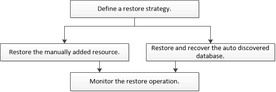

= Restaure el flujo de trabajo
:allow-uri-read: 
:icons: font
:imagesdir: ../media/

[role="lead"]
El flujo de trabajo de restauración y recuperación incluye planificar, realizar las operaciones de restauración y supervisarlas.

El siguiente flujo de trabajo muestra la secuencia que debe seguirse para realizar la operación de restauración:

También puede usar los cmdlets de PowerShell manualmente o en scripts para realizar operaciones de backup, restauración y clonado. La ayuda del cmdlet de SnapCenter y la información de referencia del cmdlet contienen detalles sobre los cmdlets de PowerShell.

https://library.netapp.com/ecm/ecm_download_file/ECMLP2886205["Guía de referencia de cmdlets de SnapCenter Software"^].
