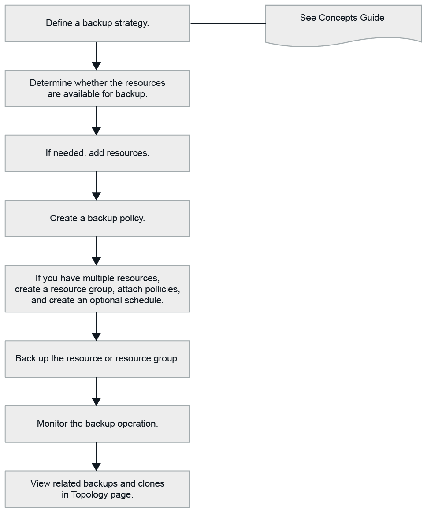

= Hacer backup de recursos de PostgreSQL
:allow-uri-read: 
:icons: font
:imagesdir: ../media/

[role="lead"]
Es posible crear un backup de un recurso (clúster) o un grupo de recursos. El flujo de trabajo de backup incluye planificar, identificar los clústeres para backup, gestionar las políticas de backup, crear grupos de recursos y añadir políticas, crear backups y supervisar las operaciones.

Los siguientes flujos de trabajo muestran la secuencia que debe seguirse para realizar la operación de backup:

También puede usar los cmdlets de PowerShell manualmente o en scripts para realizar operaciones de backup, restauración y clonado. La ayuda sobre cmdlet de SnapCenter y la información de referencia sobre cmdlet contienen más información acerca de cmdlets de PowerShell. https://docs.netapp.com/us-en/snapcenter-cmdlets/index.html["Guía de referencia de cmdlets de SnapCenter Software"^].
