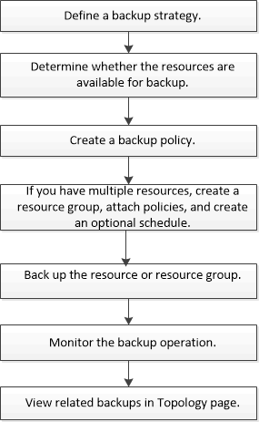

= Flujo de trabajo de copia de seguridad para el SnapCenter Plug-in para Microsoft Exchange Server
:allow-uri-read: 
:icons: font
:imagesdir: ../media/

[role="lead"]
Cuando se instala el plugin de SnapCenter para Microsoft Exchange Server en el entorno, es posible usar SnapCenter para realizar el backup de los recursos de Exchange.

Es posible programar varios backups para que se realicen simultáneamente en diferentes servidores. No se pueden ejecutar en simultáneo operaciones de backup y restauración en el mismo recurso. No se admiten las copias de backup activas y pasivas en el mismo volumen.

Los siguientes flujos de trabajo muestran la secuencia que debe seguirse para realizar la operación de backup:

