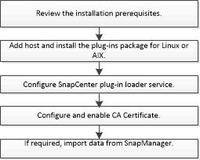

= Flujo de trabajo de instalación del plugin de SnapCenter para base de datos de Oracle
:allow-uri-read: 
:icons: font
:imagesdir: ../media/

[role="lead"]
Debe instalar y configurar el plugin de SnapCenter para base de datos de Oracle si desea proteger las bases de datos Oracle.

