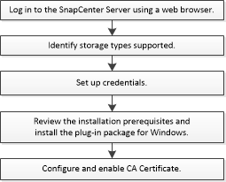

= Flujo de trabajo de instalación del plugin de SnapCenter para Microsoft Windows
:allow-uri-read: 
:icons: font
:imagesdir: ../media/

[role="lead"]
Debe instalar y configurar el plugin de SnapCenter para Microsoft Windows si desea proteger los archivos de Windows que no sean archivos de base de datos.

